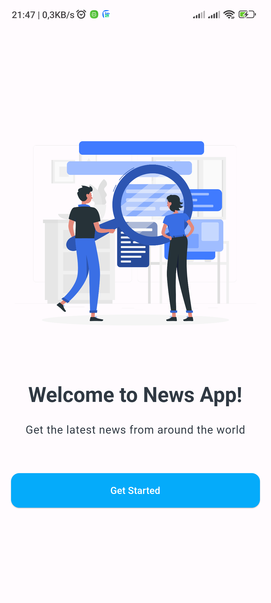
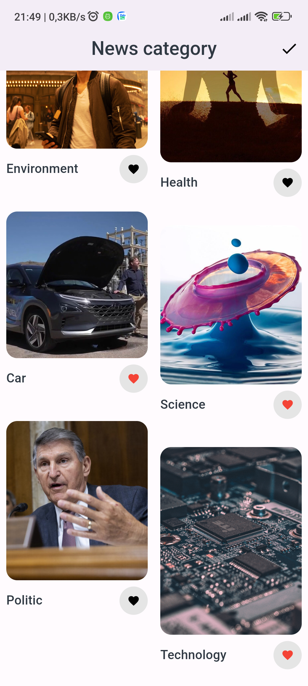
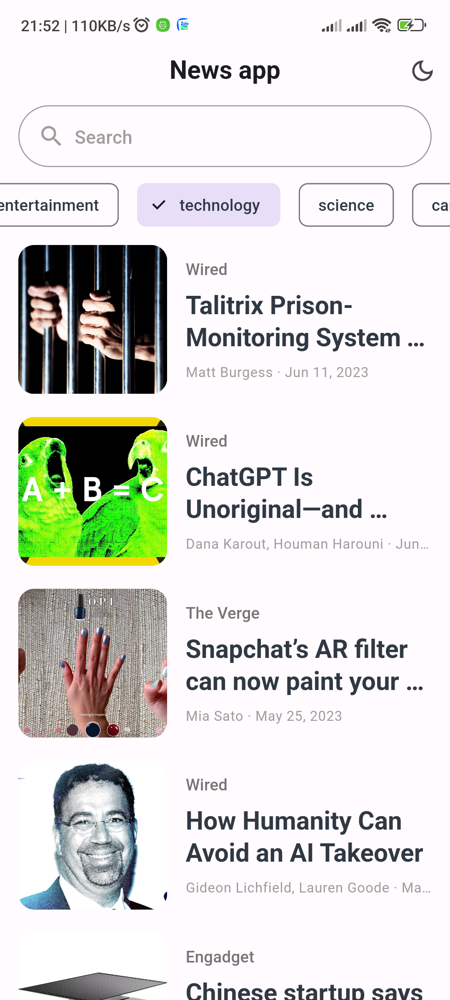
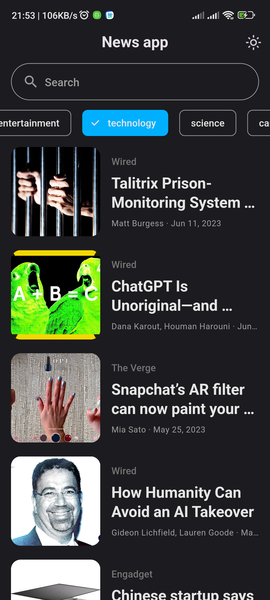
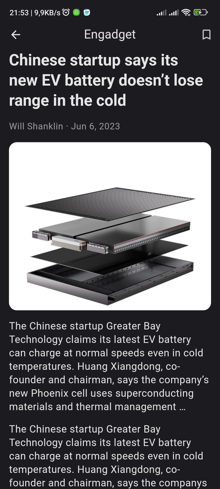

[](https://github.com/Solido/awesome-flutter)
# News App

A News App built with Flutter and News API.

The purpose of this project is to learn BLoC and Clean Architecture.

## Features

- [x] Material 3
- [x] Light and dark mode 
- [x] First time launch check
- [x] Offline mode
- [x] Infinite scroll pagination
- [ ] Refresh indicator
- [x] Search by category
- [ ] Search by keyword
- [ ] Save news

## Packages

- [flutter_bloc](https://pub.dev/packages/flutter_bloc)
- [dio](https://pub.dev/packages/dio) 
- [cached_network_image](https://pub.dev/packages/cached_network_image)
- [hive](https://pub.dev/packages/hive)
- [internet_connection_checker](https://pub.dev/packages/internet_connection_checker)
- [json_serializable](https://pub.dev/packages/json_serializable)
- [flutter_staggered_grid_view](https://pub.dev/packages/flutter_staggered_grid_view)
- [intl](https://pub.dev/packages/intl)
- [build_runner](https://pub.dev/packages/build_runner)


## Screenshots

  

  

## Installing

- Download [Flutter SDK](https://flutter.dev/docs/get-started/install) to your machine
- Install this repository
- Build and run the debug app on emulator, real device

```bash
    git clone https://github.com/tuanvumaihuynh/flutter-news-app.git
    flutter pub get
    flutter run
```
